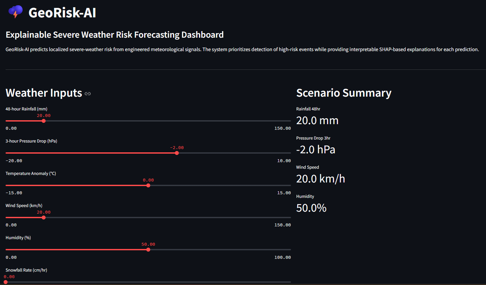
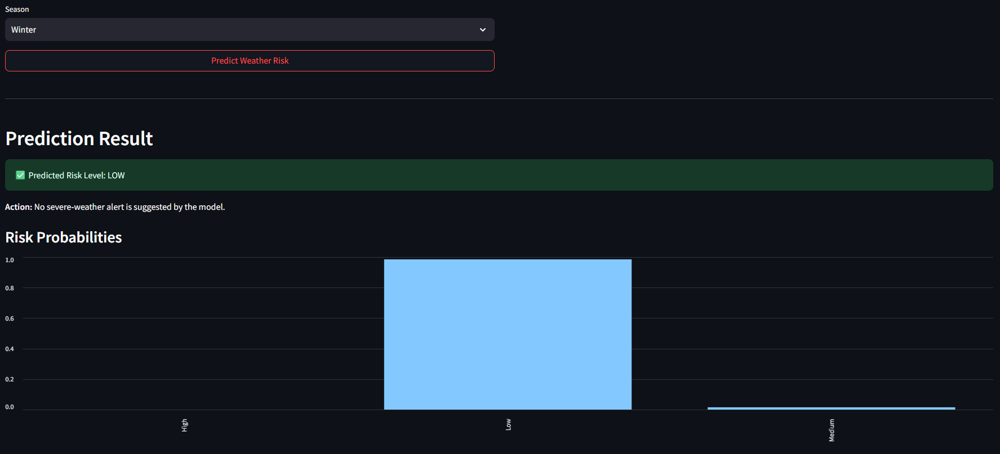
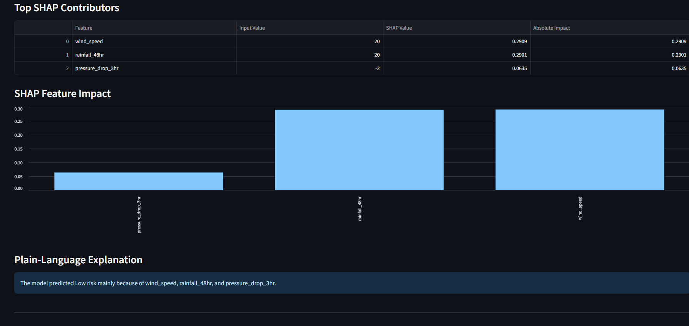
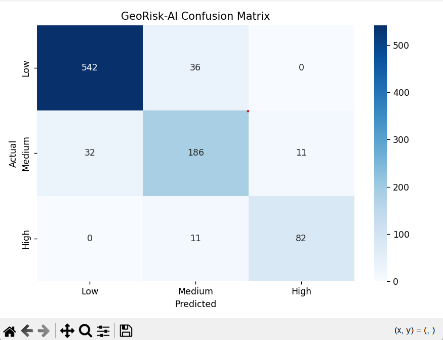
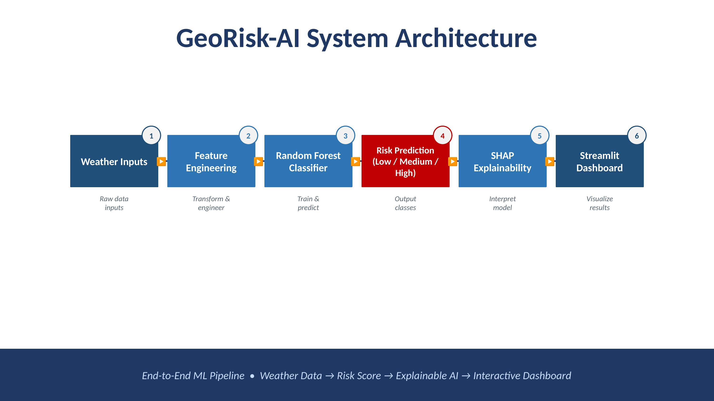

# GeoRisk-AI

## Explainable Severe Weather Risk Forecasting Dashboard

[]()
[]()
[]()
[]()

GeoRisk-AI is a machine learning prototype that classifies localized severe-weather risk as **Low**, **Medium**, or **High** using engineered meteorological features. The system combines synthetic data generation, feature engineering, comparative model evaluation, Random Forest classification, SHAP-based explainability, error analysis, and an interactive Streamlit dashboard.

---

## Live Demo

Streamlit deployment coming soon.

---

## Project Motivation

Severe weather alerts need to be timely, localized, and interpretable. This project translates weather signals such as rainfall accumulation, pressure drop, wind speed, humidity, temperature anomaly, snowfall rate, and season into a risk-level prediction that can support early decision-making.

---

## Why This Project Matters

Weather-risk forecasting systems require not only predictive performance but also interpretability and operational usability. This project was designed to simulate an end-to-end machine learning workflow that combines:

- data engineering
- feature engineering
- model evaluation
- explainable AI
- interactive deployment

The emphasis on high-risk recall reflects real-world forecasting priorities where missing dangerous events can have significant consequences.

---

## Technical Highlights

- Built an end-to-end machine learning workflow in Python
- Implemented multiclass severe-weather risk classification
- Generated synthetic weather observations with meteorological risk logic
- Compared Logistic Regression, Decision Tree, and Random Forest models
- Selected Random Forest based on overall performance and high-risk recall
- Prioritized high-risk recall for safety-oriented forecasting
- Added SHAP-based local interpretability for model predictions
- Built an interactive Streamlit dashboard for decision support
- Added confusion-matrix-based error analysis
- Structured the project as a modular ML engineering codebase

---

## Key Features

- Synthetic weather data generation for supervised prototype development
- Feature engineering using meteorological risk indicators
- Model comparison: Logistic Regression, Decision Tree, Random Forest
- Recall-focused evaluation for high-risk events
- SHAP-based local explanation for each prediction
- Streamlit dashboard for interactive risk forecasting
- Confusion matrix and error analysis workflow
- Architecture diagram and project documentation for portfolio review

---

## Dashboard Preview

### Home Dashboard



### Prediction Results



### SHAP Explainability



### Error Analysis



---

## System Architecture



```text
Weather Inputs
      ↓
Feature Engineering
      ↓
Random Forest Classifier
      ↓
Risk Prediction: Low / Medium / High
      ↓
SHAP Explainability
      ↓
Streamlit Dashboard
      ↓
Decision-Support Output
```

---

## Machine Learning Task

- **Task:** Multiclass classification
- **Target:** `Low`, `Medium`, `High` weather risk
- **Primary metric:** High-risk recall
- **Main model:** Random Forest Classifier

---

## Input Features

| Feature | Description |
|---|---|
| `rainfall_48hr` | 48-hour accumulated rainfall |
| `pressure_drop_3hr` | 3-hour atmospheric pressure change |
| `temp_anomaly` | Temperature deviation from expected conditions |
| `wind_speed` | Current wind speed |
| `humidity` | Relative humidity |
| `snowfall_rate` | Snowfall accumulation rate |
| `season` | Encoded seasonal context |

---

## Current Results

Model comparison on the synthetic prototype dataset:

| Model | Accuracy | Weighted F1 | High-Risk Recall |
|---|---:|---:|---:|
| Random Forest | 0.9000 | 0.9003 | 0.8817 |
| Decision Tree | 0.8944 | 0.8956 | 0.8495 |
| Logistic Regression | 0.8800 | 0.8799 | 0.8710 |

Random Forest was selected as the main model because it achieved the strongest balance between overall classification performance and high-risk recall.

The error analysis shows that most confusion occurs around boundary cases between **Low**, **Medium**, and **High** risk, which is realistic for weather-risk classification.

---

## Error Analysis Insight

The confusion matrix indicates strong performance on low-risk and high-risk cases, with most errors occurring around medium-risk boundary conditions. This is an important result because medium-risk cases often represent transitional weather states where the signal is less clearly separable.

For severe-weather decision support, the project prioritizes identifying high-risk events rather than optimizing accuracy alone.

---

## Project Structure

- `app.py` — Streamlit dashboard
- `requirements.txt` — Python dependencies
- `README.md` — project documentation
- `src/` — ML pipeline source code
- `data/` — processed and raw data folders
- `images/` — dashboard screenshots and architecture diagram
- `artifacts/` — saved model artifacts
- `reports/` — reports and outputs
- `notebooks/` — analysis notebooks

---

## Main Source Files

- `src/data_gen.py` — generates synthetic weather-risk data
- `src/data_loader.py` — loads processed data
- `src/features.py` — defines model features and target variables
- `src/train.py` — trains and saves the Random Forest model
- `src/predict.py` — runs inference on new weather scenarios
- `src/explain.py` — generates SHAP-based explanations
- `src/model_comparison.py` — compares candidate ML models
- `src/error_analysis.py` — produces evaluation report and confusion matrix

---

## How to Run Locally

### 1. Clone the repository

```bash
git clone https://github.com/alaindika/GeoRisk-AI.git
cd GeoRisk-AI
```

### 2. Create and activate a virtual environment

```bash
python -m venv venv
venv\Scripts\activate
```

### 3. Install dependencies

```bash
pip install -r requirements.txt
```

### 4. Generate synthetic weather data

```bash
python -m src.data_gen
```

### 5. Train the model

```bash
python -m src.train
```

### 6. Run model comparison

```bash
python -m src.model_comparison
```

### 7. Run error analysis

```bash
python -m src.error_analysis
```

### 8. Run the dashboard

```bash
streamlit run app.py
```

---

## Technologies Used

- Python
- pandas
- NumPy
- scikit-learn
- SHAP
- Streamlit
- matplotlib
- seaborn
- joblib

---

## Limitations

This prototype is trained primarily on synthetic weather data. The synthetic dataset is useful for demonstrating the end-to-end ML engineering workflow, but it does not replace validation on real meteorological records.

The next major improvement is to integrate real Environment Canada weather data and validate the model against real severe-weather events.

---

## Future Improvements

- Integrate real Environment Canada weather data
- Add real-event labeling
- Deploy the dashboard online
- Add advanced SHAP waterfall plots
- Extend the system toward time-series forecasting
- Add geospatial risk visualization
- Add automated retraining workflow
- Add model card documentation
- Add unit tests for core pipeline modules

---

## Resume-Ready Project Summary

**GeoRisk-AI — Explainable Severe Weather Risk Forecasting Dashboard**  
Built an end-to-end ML prototype for multiclass severe-weather risk classification using engineered meteorological features, Random Forest modeling, SHAP explainability, model comparison, error analysis, and an interactive Streamlit dashboard.

GitHub: https://github.com/alaindika/GeoRisk-AI

---

## Author

**Alain Dika**  
Applied Mathematician | AI Graduate Student | ML/AI Engineering Portfolio